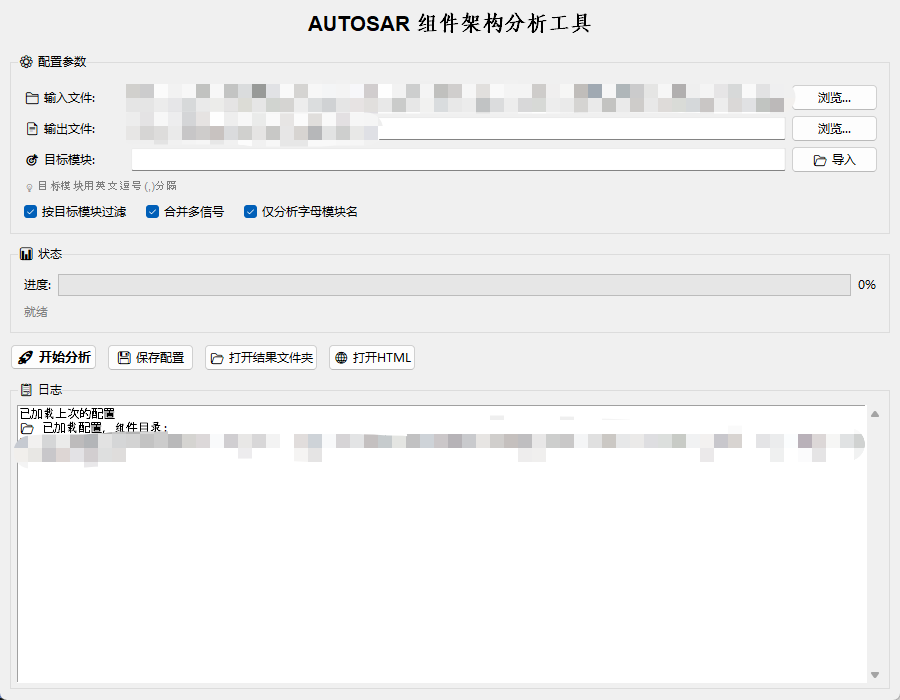
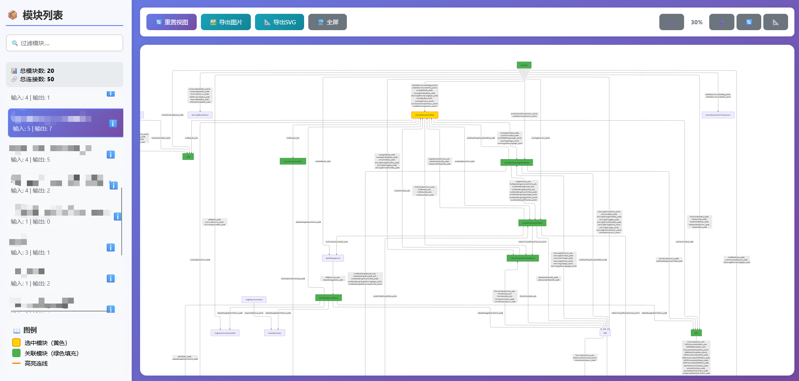

# AUTOSAR Architecture Visualizer

An interactive analysis and visualization tool for AUTOSAR component architectures. 
Parse RTE header files, extract component dependencies, and generate interactive 
architecture diagrams with Mermaid.

## Features
- 📊 Visualize AUTOSAR component dependencies
- 🔍 Interactive node highlighting and filtering
- 📈 Export to SVG/PNG formats
- 🔄 Real-time architecture analysis

## Usage
用于分析GenData\Components下所有的Rte_Module.h文件，提取模块之间的连线关系，生成可视化与可交互的html文件，便于分析各模块之间的信号传递关系与架构脉络

### GUI 主界面

### 架构可视化&交互式高亮

